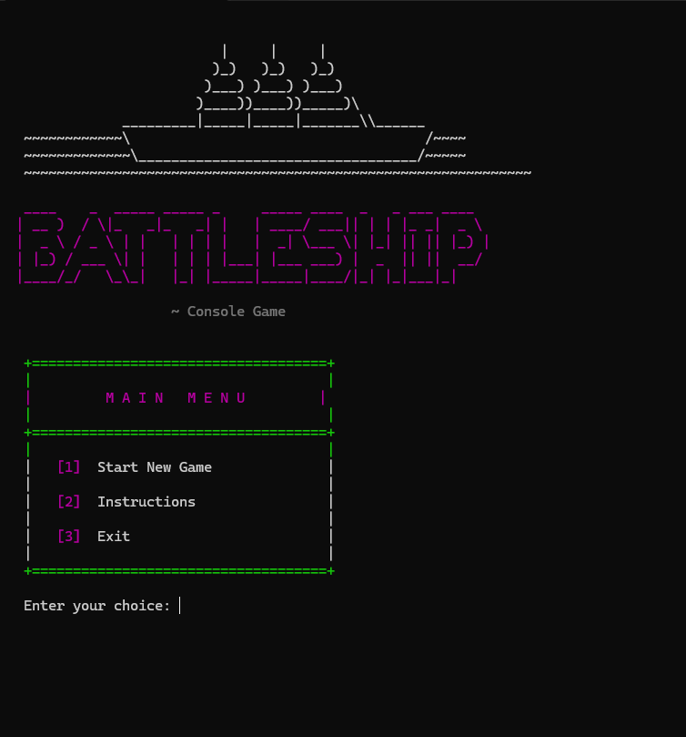
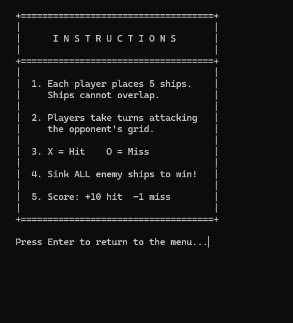
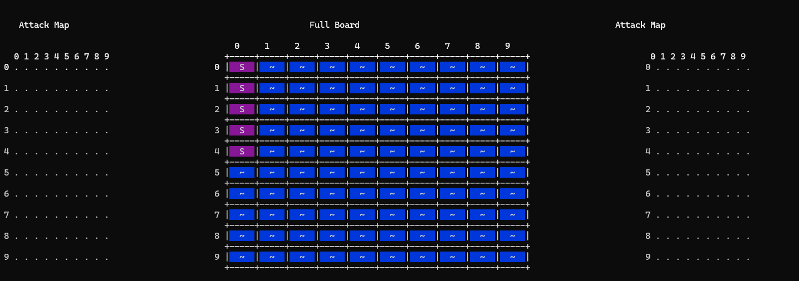

# Battleship-Console-Game

A console based Battleship game written in C++

---

## Modes

- Player vs Player
- Player vs Computer

---

## How to Play

1. Each player places 5 ships which cannot overlap.
1. Players take turns attacking the opponent's grid.
1. Sink all Opponents Ships to WIN.

---

## Screenshots

Main Menu


Instructions


Placing Ships


---

## How to Run

### Requirements
- C++ compiler (g++ or MSVC)

### Compile & Run (g++)

```bash
g++ main.cpp -o Battleship
./Battleship
```

---

## Built With

